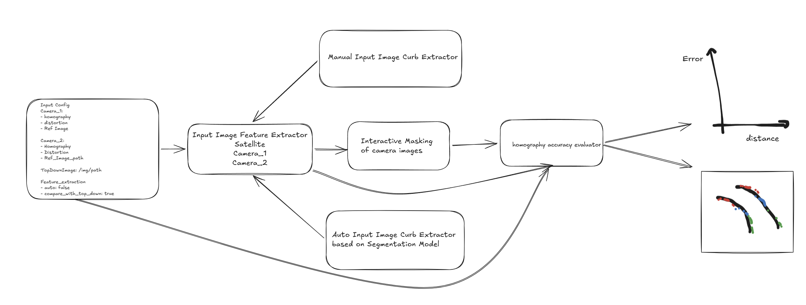

# Project Overview
This is a python project to evaluate the accuracy of pre-computed homography matrix

The validation is done based on two categories:
1. Man Made feature comparison to satellite image(like bollards, curbs) i.e using top down image from satellite/drone as a reference and seeing how well the same features extracted from an image align
2. Geometric characteristics/Self Consistency i.e. parallel lines in real world should be projected as parallel

The feature extraction itself is conducted in two modes
1. **Manual**: Interactive window to pick points and interoplate to obtain a dense set of points for binary masking
2. **Auto**: Features extracted automatically by a Segmentation model

Validation Criteria
1. **Chamfer Distance (Reference-Based comparison)**
This method evaluates how well the camera "aligns" with a known map (the satellite image).

2. **Parallel Line Divergence (Self-Consistency)**
This method evaluates the internal logic of the homography without needing a satellite map.

The image below is the overview of the project

## Input
Input data for this is located under `resources` folder
YAML config 
1. Homography matrix (3x3)
2. Distortion Parameters (1 x 6)
3. Extrinsics (to determine the forward direction)
4. Top View Satellite Image
4. Input Camera Image(s) corresponding to the floor plan
5. Configuration for Feature Extraction from Images

   a. Manual mode to manually pick feature points
   b. Auto mode to use a Segmentation model to filter points of interest
   c. Flags to whether run distortion or not
6. Homography Evaluation (not shown in picture explicitly)
   a. Evalution mode to pick between two modes of validation as explained in the overview section

## Output
1. Plot of Error as stratified by distance
2. Error back projected on the satellite image as a heat map

# Module Details
1. Input Image Feature Extractor

    This module is responsible for loading images, undistorting if enabled and to support manual/auto modes of feature extraction. 
    Currently, support for manual mode is only implemented but the module should cater for both manual and auto for extensibility. 

    The manual mode prompts the user to pick the image points interactively with a open window. When user is done, the picked points are further densified using a suitable interpolator

    This process needs to be repeated for satellite/topview image as well if the validation mode is set to comparison. Picking on satellite image can be skipped if the validation model is self

    The output from this module is the binary image with picked pixel points as 1 and rest as 0

2. Interactive Masking
    This module further helps to reduce the points for comparison with reference image on the binary mask created. User selects this using a ROI bounding box. The purpose of this is to ensure that the points in image are always a subset of what is visible in the satellite image

    In the Self-consistency mode it further allows to eliminate any spurious points on the binary image

    This module works on camera images only

3. Homography Evaluator

    This is the main module that does the following:
    1. Projects "1" pixel points using the homography matrix
    2. If comparison mode is reference:

        a. Computes the chamfer distance of the original top view image pixel points to the binary mask of the top view image

        b. Computes the accuracy score by computing the chamfer distance of projected pixel points with matrix computed in step above

        c. Check details of the implementation in the [next section](#ValidationCriteria)

    3. If comparison mode is self-consistency it computes the parallel divergence score based on description in [next section](#ValidationCriteria)

    4. To achieve the results in stratified fashion, the points are sliced based on distance in front of the camera - X/Y direction is determined by the extrinsics

    5. Errors are also projected back to original top view image to render the error in a heat map style

4. ValidationCriteria 

    1. Chamfer Distance (Reference-Based Evaluation)

        This approach measures absolute spatial error by comparing your projected pixels against a "Gold Standard" satellite map.
        
        Implementation Steps
        Generate the Reference Distance Map:
        Isolate the curb/lane markings in the satellite image to create a binary mask $M_{sat}$.
        
        Apply a Euclidean Distance Transform (EDT) to $M_{sat}$. 
        
        Each pixel $(x, y)$ in the resulting map $DT_{sat}$ now stores the distance to the nearest "truth" edge.
        
        Process the Camera Input:Undistort: Use known camera intrinsics to remove radial distortion from the frame.
        
        Segment: Extract ground-plane edge pixels $P_{cam} = \{(u_1, v_1), ..., (u_n, v_n)\}$.
        
        Coordinate Transformation: Apply the homography $H$ to all $P_{cam}$ points to get world-space coordinates $P'_{world}$.
        
        Note: Use cv2.perspectiveTransform() for batch processing.
        
        Error Calculation: For every projected point $(x'_i, y'_i)$, sample the value at that coordinate in $DT_{sat}$.

        Metric: $Error = \frac{1}{n} \sum DT_{sat}(x'_i, y'_i)$.

        Uses `scipy.ndimage.distance_transform_edt`
    
    2. Parallel Line Divergence (Consistency Evaluation)
    
        This approach measures geometric distortion (specifically pitch and roll errors) using only the image data.
        
        Implementation Steps
        
        Line Extraction:Detect long, linear features known to be parallel (e.g., the drive-thru lane edges).
        
        Represent these as two sets of points or two line equations in the image plane: $L_1$ and $L_2$.
        
        Top-Down Projection:Project the coordinates of these lines into the world plane using $H$.
        
        Divergence Measurement:Angular Error: Calculate the angle $\theta$ between the two projected lines. 
        
        In a perfect homography, $\theta = 0^\circ$.
        
        Width Consistency: Measure the perpendicular distance $W$ between the lines at various distances $d$ from the camera.
        
        Metric Analysis:Calculate the variance $\sigma^2$ of the width $W$ across the distance $d$.
        
        High Variance = The homography is "pinching" or "flaring" the ground plane as it moves toward the horizon.

        Uses `cv2.HoughLinesP` or `LineSegmentDetector`

        ✦ The calculate_parallel_divergence function evaluates the geometric consistency of the homography by measuring how well parallel features in the real world (e.g., lane markings)
  maintain their parallelism after being projected into the top-down world plane.